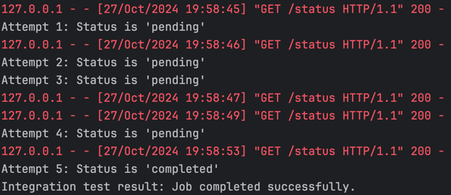
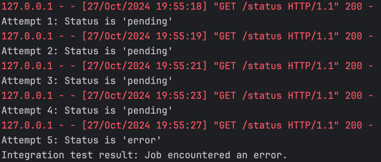
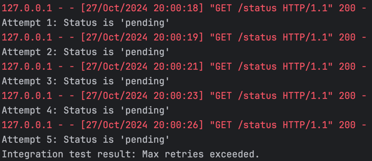

# Video Translation Simulation

This repository provides a server-client simulation of a video translation service.

## Requirements
- Python 3.x
- Flask (for server)
- `requests` library (for client)

## Getting Started

1. **Install Dependencies:**
   ```bash
   pip install flask requests
   ```

2. **Run the Server:**
   ```bash
   python server.py
   ```

3. **Use the Client:**
   Initialize the client and call `check_status`:
   ```python
   from client import VideoTranslationClient
   client = VideoTranslationClient(base_url="http://127.0.0.1:5000")
   result = client.check_status()
   print(result)
   ```

4. **Run Integration Test:**
   ```bash
   python test_integration.py
   ```

## Example Output

1. Job completed successfully.


2. Job encountered an error.


3. Max retries exceeded.


## Future Improvements

1. **Server Callbacks**: Server notifies client when the job is done, eliminating the need for polling.

2. **Estimated Completion Time**: Server provides job completion estimates, allowing the client to optimize status checks.
